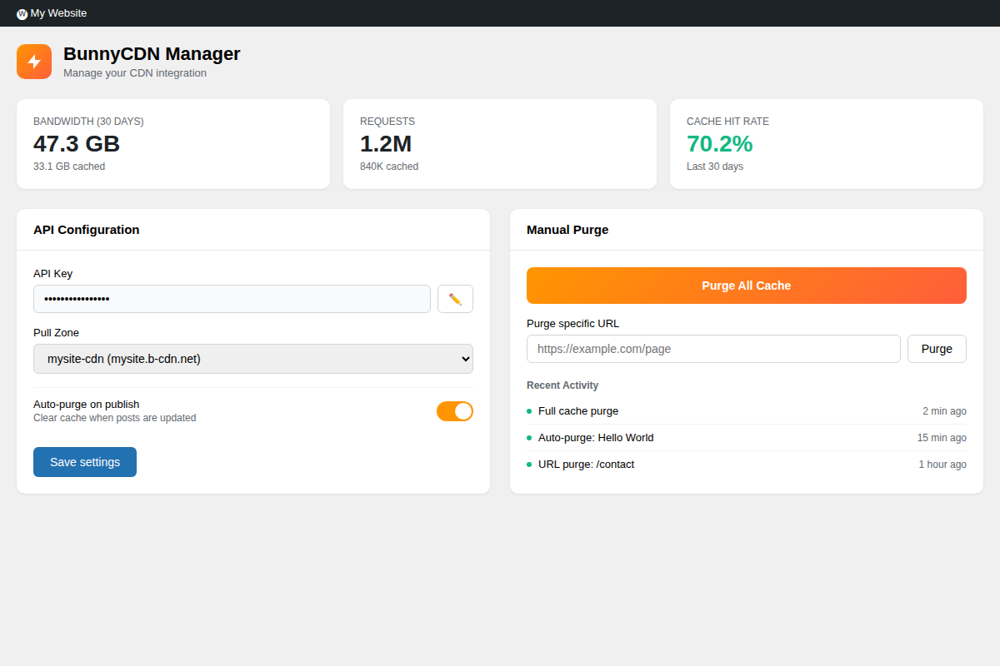
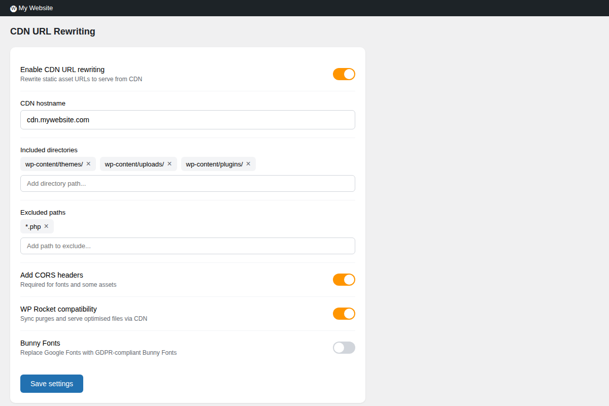
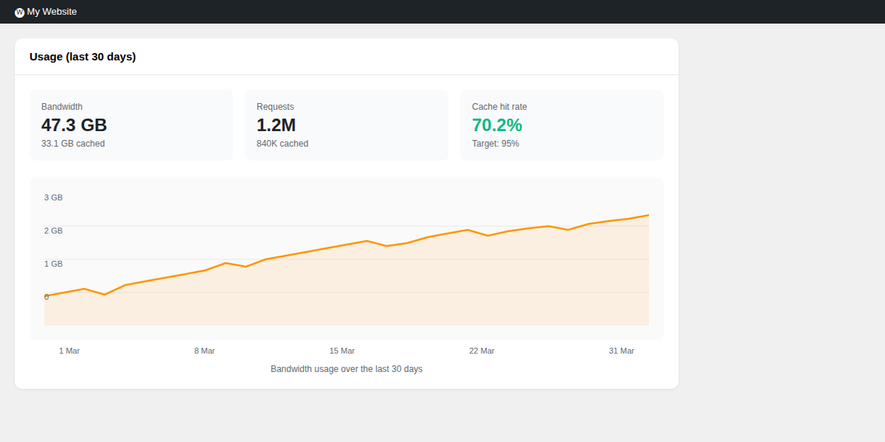
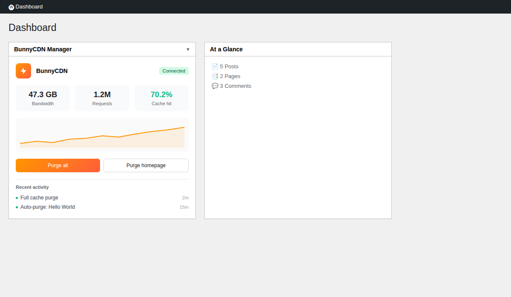
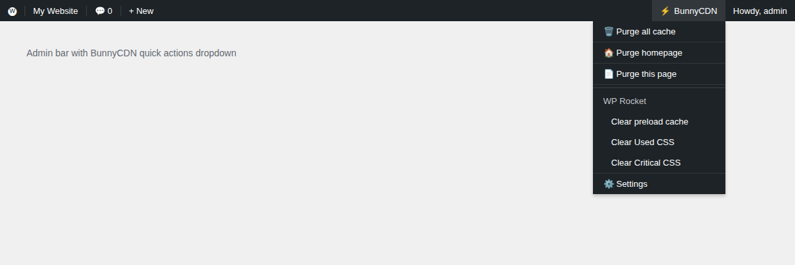

# BunnyCDN Manager

A WordPress plugin for managing your BunnyCDN integration. Purge cache automatically when content changes, rewrite URLs to serve assets from your CDN, and monitor usage stats from your dashboard.

## Features

**Cache Purging**
- Purge entire zone or specific URLs
- Auto-purge when posts are published or updated
- Clears related URLs (homepage, archives, taxonomy pages)
- Admin bar shortcuts for quick access
- Activity log showing recent purges

**CDN URL Rewriting**
- Rewrites static asset URLs to your CDN hostname
- Configure which directories to include
- Exclude specific paths or file patterns
- CORS headers for fonts and cross-origin assets
- Disable for logged-in admins when debugging

**Usage Statistics**
- Bandwidth and request counts
- Cache hit rate
- 30-day usage chart
- Dashboard widget for quick overview

**WP Rocket Integration**
- Syncs cache purges between WP Rocket and BunnyCDN
- Serves optimised files through your CDN
- Admin bar shortcuts for clearing Used CSS, Critical CSS, and preload cache

**Bunny Fonts**
- Replaces Google Fonts with privacy-friendly Bunny Fonts
- No code changes required
- GDPR compliant

**Security**
- API key encrypted at rest
- Nonce verification on all actions
- Capability checks throughout

## Screenshots

### Settings

### CDN Options

### Usage Stats

### Dashboard Widget

### Admin Bar

## Requirements

- WordPress 6.0+
- PHP 7.4+
- BunnyCDN account with a Pull Zone

## Installation

1. Download the latest release
2. Upload to `/wp-content/plugins/bunnycdn-cache-purge/`
3. Activate the plugin
4. Go to **BunnyCDN Manager** and enter your API key

Your API key is in the BunnyCDN dashboard under Account Settings > API.

## Changelog

### 1.0.0
Initial release.

## Licence

GPL v2 or later.

## Author

[Michael Overton](https://overton.cloud)
